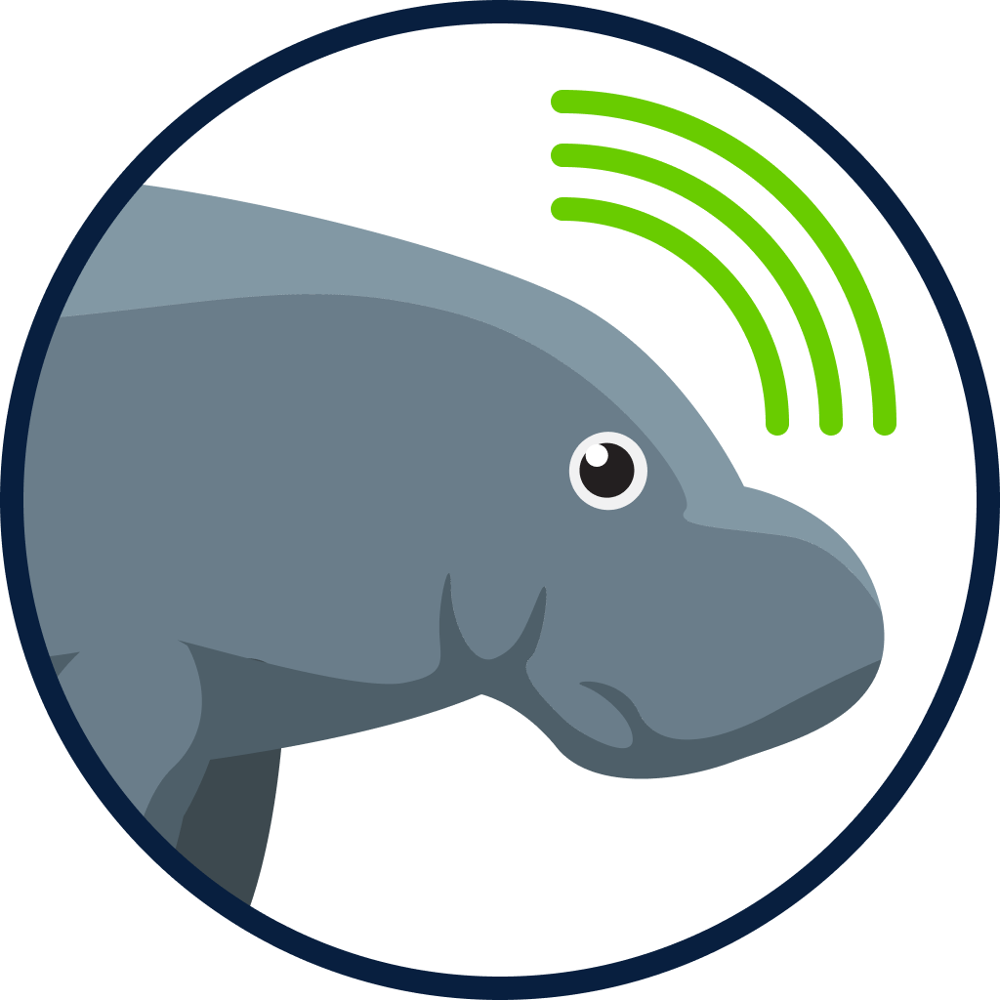
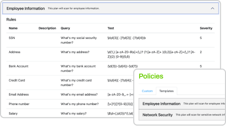
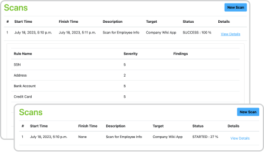
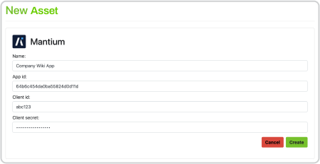
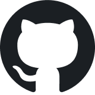

## Description

OWASP Chirps is an open source, Django-based, Python web application that allows users to search and scan vector databases for sensitive data, test your LLM API for Prompt injection, and find other Generative AI Vulnerabilities.

The application can connect to LLM API endpoints, vector databases like Redis and Pinecone, and Mantium Chat applications. Users can create and manage scanning policies, execute scans against an asset using a selected plan, and view the results of the scan, including any findings.

## Policies

Leverage premade or custom rule sets to help identify the information you are looking for in your vector databases.

## Scans

Manage your scans and their results. Create, execute, and analyze scans using plans with defined rules. And when the scan is complete, review scan findings to see what information you need to remove from your vector database.

## Assets

Interact with Mantium applications and vector databases like Redis and Pinecone for storing and searching document embeddings. Users can create, edit, and delete asset configurations, which include connection details and authentication credentials.

## Use Github Codespaces

Github’s Codespaces is enabled so you don’t need to fork, pull, merge, or anything else. Just spin up a fully configured dev environment in seconds and start coding.

<a href="https://github.com/mantiumai/chirps#chirps"><i class="fab fa-github">&nbsp;Get Started</i></a>

## Contributors

OWASP Chirps has been created by
<a href="mailto:&#114;&#121;&#097;&#110;+&#111;&#119;&#097;&#115;&#112;&#064;&#109;&#097;&#110;&#116;&#105;&#117;&#109;&#097;&#105;&#046;&#099;&#111;&#109;">Ryan Sevey</a> and is developed, maintained by [these contributors](https://github.com/mantiumai/chirps/graphs/contributors).

## Licensing

This program is free software: You can redistribute it and/or modify it under the terms of the
[GPL 3.0 License](https://github.com/mantiumai/chirps/blob/master/LICENSE).
OWASP Chirps and any contributions are Copyright © by Ryan Sevey & the OWASP Chirps contributors 2023.
